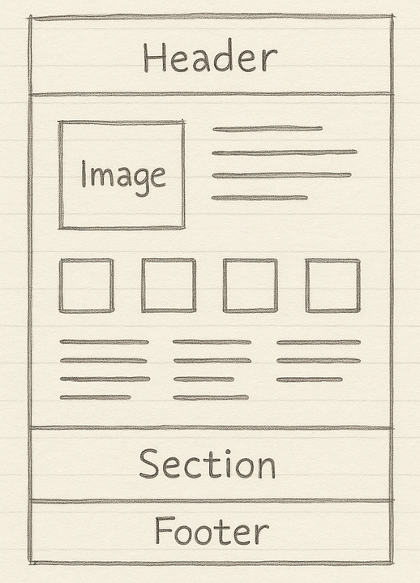

# 📚 CSS: Document Flow, Position, Z-Index

## 📌 1. Document Flow

**Document Flow (потік документу)** — це порядок, у якому елементи HTML відображаються на сторінці без додаткового втручання (CSS-позиціонування).

**Типовий потік** — зверху вниз, зліва направо (для блочних елементів).

#### Приклад



```
Header (меню)
↓
Section 1 (зображення зліва -> текст справа)
↓
Section 2 (1 зображення -> 2 зображення -> 3 зображення -> 4 зображення)
↓
Section 3 (1 текст колонка -> 2 текст колонка -> 3 текст колонка)
↓
Footer
```
---

## 📌 2. `position` – властивість позиціонування

- `static`   - за замовчуванням у потоці документа
- `relative` - зміщується **відносно себе**, але займає попереднє місце
- `absolute` - виходить з потоку, позиціонується **відносно батька**
- `fixed`    - виходить з потоку, прив'язується до **вікна браузера**
- `sticky`   - змішує `relative` + `fixed`, залишається на місці при 

Також, елементи розташовуються за допомогою властивостей `top`, `bottom`, `left` і `right`. **Ці властивості не працюватимуть, якщо спочатку не встановлено значення для властивості `position`, яке відмінне від `static`.** Крім того, їхня поведінка **змінюється залежно від значення `position`**.

---

### 📍 `position: static` (дефолт)

```html
<div class="box">Box</div>
```

```css
.box {
  position: static;
}
```

🔹 У потоці, жодних зсувів. Це значення за замовчуванням.

---

### 📍 `position: relative`

```css
.box {
  position: relative;
  top: 20px;
  left: 10px;
}
```

🔹 Зміщується, **але залишається на місці в потоці**. Можна «посунути» візуально.

---

### 📍 `position: fixed`

```css
.box {
  position: fixed;
  top: 0;
  right: 0;
}
```

🔹 Виходить з потоку. Завжди прив'язаний до **вікна** браузера, не змінює позицію при скролі.

---

### 📍 `position: absolute`

```css
.wrapper {
  position: relative;
}

.box {
  position: absolute;
  top: 0;
  right: 0;
}
```

🔹 Виходить з потоку. Прив'язаний до **першого батька з `relative|absolute|fixed`**.

---

### 📍 `position: sticky`

```css
.box {
  position: sticky;
  top: 10px;
}
```

🔹 В межах батьківського блоку прилипає до краю (top/right/...).

---

## ⚠️ 3. Performance & Accessibility

**Проблема:** `fixed` та `sticky` елементи → часте перемальовування → зниження fps → лаги → незручність для людей із обмеженими можливостями.

**Рішення:**  Додай `will-change: transform;` щоб підказати браузеру оптимізувати рендер.

```css
.box {
  position: fixed;
  will-change: transform;
}
```

---

## ⏭️ Заготовки (на майбутнє)

### ▶️ Псевдокласи (`:hover`, `:nth-child`, `:focus`, тощо)
### ▶️ Псевдоелементи (`::before`, `::after`, `::marker`, тощо)


## 🔹 Flex + `absolute`

### Код:
```css
.container {
  display: flex;
  gap: 40px;
}
.item {
  position: absolute;
}
```

### Поведінка:
- Flex-контейнер **ігнорує** елементи з `position: absolute`.
- `gap` розраховується тільки між елементами у **нормальному потоці**.
- Візуальні зсуви можуть здаватися некоректними, бо `absolute`-елементи не впливають на `gap`.
- лише статичні/relative елементи у flex, якщо розраховуєш на gap

---

## 🔸 Grid + `absolute`

### Код:
```css
.container {
  display: grid;
  grid-template-columns: 1fr 1fr;
  gap: 40px;
}
.grid-item {
  position: relative;
}
.grid-item img {
  position: absolute;
}
```

### Поведінка:
- `grid-template-columns` та `gap` працюють **незалежно від вмісту**.
- `absolute`- позиціоновані елементи **не впливають на розмітку сітки**.
- Розкладка залишається передбачуваною.

---

## Приклади

### Flex — "зламаний" вигляд:
```html
<div class="flex">
  <div class="box relative-bg"></div>
  <div class="content"></div>
</div>
```

```css
.flex {
  display: flex;
  gap: 50px;
}

.relative-bg::before {
  content: '';
  position: absolute;
  width: 200px;
  height: 200px;
  background: red;
}
```
➡ `::before` виходить за межі — візуально порушуючи `gap`.
---

### Grid — стабільність:
```css
.grid {
  display: grid;
  grid-template-columns: 1fr 1fr;
  gap: 50px;
}
```
➡ Сітка стабільна, навіть з `absolute`- елементами всередині.

---

### Джерела:

- [BUI video 7](https://www.youtube.com/watch?v=vHpK2cd6eOs&list=PLeX0VTr3t-vGoRD25PX8KQZkacrjmRFEZ&index=12) 
- [CSS Layout - The position Property](https://www.w3schools.com/css/css_positioning.asp)
- [MDN position](https://developer.mozilla.org/en-US/docs/Web/CSS/position)
- [css.in.ua position](https://css.in.ua/css/property/position)