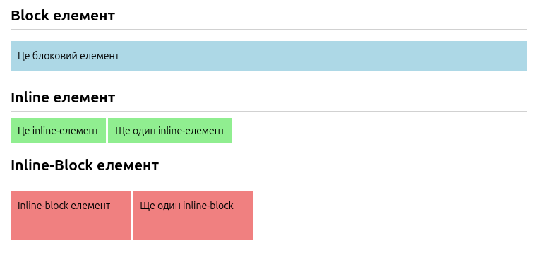

# 📚 CSS та HTML довідник

## 1. Обнулення стилів

> "Обнулення" дефолтних браузерних пропертей з user_agent html.css, можна ще використовувати reset.css or normalizer.css.

```css
* {
  padding: 0;
  margin: 0;
  border: 0;
}
```

## 2. font-weight

```css
font-weight: 400; - (normal) - дефолтне значення браузера
```

## 3. Layout

```css
.container {
  width: 90%;         /* or padding: 0 10px; */
  max-width: 1280px;  /* максимально дозволена ширина контейнера */
  margin: 0 auto;     /* горизонтальне центрування → */
}
```

1. Контейнер займатиме **90%** доступної ширини від батьківського елемента. Якщо вікно браузера має ширину **1400px** (1400 × 90 / 100), то `width: 90%` → **1260px**.

2. Якщо **90%** вікна буде більше, ніж **1280px** (наприклад, на екрані **1600px** — 90% = 1440px), контейнер залишиться шириною **1280px**.

   - **На маленьких і середніх екранах** (наприклад, **800px**) → контейнер буде **90%** від доступної ширини (**720px**).

   - **На великих екранах** (наприклад, **1600px**) → спершу рахується **90%** (**1440px**), але оскільки це більше за `max-width`, використовується **1280px**.

3. Задає верхній і нижній відступи — **0**, а лівий і правий — **автоматично**. Це центрує блок горизонтально, коли у нього є фіксована або обмежена ширина (через `width` або `min/max-width`).

4. `overflow: hidden;` — **сховати вміст, який вибивається за межі контейнера**.

## 4. float

`float` — «відриває» елемент від нормального потоку документа і ставить його **вліво** або **вправо**. Елементи, що йдуть після нього, **обтікають** його.

### Особливості

- Якщо використовуєш `float`, тримай `display: block` (або взагалі не задавай `display`, оскільки `float` сам змусить елемент поводитися як блоковий).

- `float` хоче **«плавати» та обтікатися**, а `inline-block` хоче **стояти поруч з іншими на рядку**, залишаючись у потоці.

## 5. Де 1%?

```css
.navigation-logo {
  width: 20%;
  ...;
}

.navigation-menu {
  width: 79%;
  ...;
}
```

### Потенційні причини:

- **Пробіли між `inline-block` елементами займають місце**.

- **Borders** та **padding** можуть враховуватись або ігноруватись (залежно від налаштування `box-sizing`).

- **Округлення в `%`** — браузери можуть по-різному обробляти дробові значення, особливо на малих екранах.

- **Заголовки чи контент у логотипі** можуть виходити за межі, ламаючи лінію.

### Як уникнути проблеми:

- **Залишати невеликий запас** замість точного розподілу на 100%.

- **Прибрати пробіли** між `inline-block` елементами через `font-size: 0` у батьківського елемента (потім відновити всередині).

- **Використовувати сучасні підходи**: `flex` та `grid`

## 6. Синтаксис для `margin` та `padding`

>> `top` `right` `bottom` `left`

```css
  margin: 32px 0 27px; /* top-32 right/left-0 bottom-27 */
```  

## 7. Типи відображення елементів у CSS

### 📌 inline
- Розміщується в одному рядку з іншими елементами.
- **НЕ починається з нового рядка** (`\n`).

- **Неможливо задавати `width` та `height`** — займає лише стільки, скільки займає контент.

- Підтримує **лише горизонтальні відступи** `margin` та `padding`.
  - `margin-top` / `margin-bottom` — **ігноруються**.

  - `padding-top` / `padding-bottom` — **не збільшують висоту рядка**, а розширюють «невидиму» зону всередині `line-height`. Це створює тиск на сусідні рядки, але не зсуває їх.

- Якщо є 2 inline-елементи — **між ними буде пробіл**.

**Приклади тегів:** `<span>`, `<a>`, `<strong>`, `<em>`

---

### 📌 block
- Займає **всю доступну ширину** батьківського елемента.

- **Починається з нового рядка** (`\n`).

- Можна задавати `width` та `height`.

- Підтримує `margin` та `padding` **з усіх сторін**.

**Приклади тегів:** `<div>`, `<p>`, `<section>`, `<h1>`

---

### 📌 inline-block
- Розміщується в одному рядку з іншими елементами.

- Можна задавати `width` та `height`.

- Підтримує `margin` та `padding` **з усіх сторін**.

- Якщо є 2 елементи — **між ними буде пробіл**.

**Приклади:** кнопки, елементи меню, кастомні компоненти, які потребують розмірів.

---

## 📌 Як прибрати пробіли між inline та inline-block елементами?
- Видалити пробіли між тегами в HTML.

- Встановити `font-size: 0` для батьківського елемента, а потім **повернути розмір** шрифту всередині.

- Використовувати **Flexbox** або **CSS Grid** замість `inline-block`.

```html
<div style="color: black;">
  <h2>Block елемент</h2>
  <div style="background: lightblue; padding: 10px;">Це блоковий елемент</div>

  <h2>Inline елемент</h2>
  <span style="background: lightgreen; padding: 10px;">Це inline-елемент</span>
  <span style="background: lightgreen; padding: 10px;">Ще один inline-елемент</span>

  <h2>Inline-Block елемент</h2>
  <span style="display: inline-block; background: lightcoral; width: 150px; height: 50px; padding: 10px;">
    Inline-block елемент
  </span>
  <span style="display: inline-block; background: lightcoral; width: 150px; height: 50px; padding: 10px;">
    Ще один inline-block
  </span>
</div>
```


