# 📚 CSS та HTML довідник

## 📌 1. CSS Box Model.

### Що таке Box Model?

Box Model — це концепція в CSS, яка визначає структуру елементів на сторінці та розрахунок їхніх розмірів і відступів.

**Елемент** — це прямокутна коробка, яка складається з кількох зон.

---

### Структура Box Model:

- **Content** — основний вміст елемента (текст, зображення).  
- **Padding** — відстань від контенту до рамки.  
- **Border** — рамка навколо padding.  
- **Margin** — відстань від border до сусідніх елементів.  
- **Outline** — візуальна лінія поза border. Не впливає на розміри елемента та не входить до Box Model.

#### Приклад:

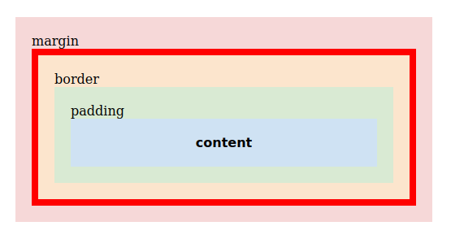


### Що є контентом, а що є елементом?

- **Content** — вміст елемента (`width`, `height`, текст, зображення).  
- **Елемент** — контент разом з `padding`, `border` і `margin`.

### Що входить у Box Model?

- **Content**
- **Padding**
- **Border**
- **Margin**  
> `Outline` — **поза моделлю**, не бере участі в розрахунках.

### Що входить у розрахунок при `box-sizing`.

| Параметр         | `content-box` (за замовчуванням)   | `border-box`                     |
|:----------------|:----------------------------------|:---------------------------------|
| `width`/`height` | тільки content                      | включає content + padding + border |
| padding, border  | додаються до `width` і `height`     | включені всередині заданих `width` і `height` |
| margin           | завжди додається ззовні (не бере участі) | завжди додається ззовні (не бере участі)             |

## 📌 2. Властивість `box-sizing`.

### Значення:
- `content-box` — розміри визначають тільки **content**.
- `border-box` — розміри включають **content + padding + border**.
- `inherit` — успадковує значення від батьківського елемента.

---

#### Приклад:

```html
<div class="content-box">Content box</div>
<br />
<div class="border-box">Border box</div>
```

```css
div {
  width: 160px;
  height: 80px;
  padding: 20px;
  border: 8px solid red;
  margin-top: 50px;
  background: yellow;
}

.content-box {
  box-sizing: content-box;

  /* 
    Total width: 160px + (2 * 20px) + (2 * 8px) = 216px
    Total height: 80px + (2 * 20px) + (2 * 8px) = 136px

    Content box width: 160px
    Content box height: 80px 
  */
}

.border-box {
  box-sizing: border-box;

  /* 
    Total width: 160px
    Total height: 80px

    Content box width: 160px - (2 * 20px) - (2 * 8px) = 104px
    Content box height: 80px - (2 * 20px) - (2 * 8px) = 24px 
  */
}
```

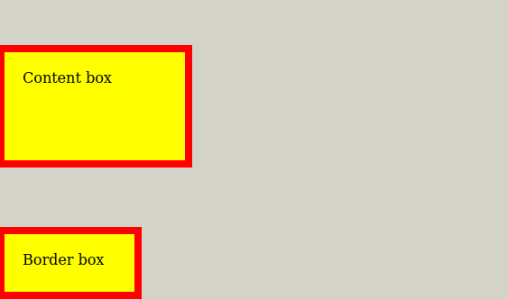

---

## Підсумок.

- **Box Model** визначає структуру і розрахунок габаритів елемента.
- **box-sizing** дозволяє контролювати, що саме враховується в `width` та `height`.
- **Outline** — поза Box Model.

## 📌 3. Margin Collapsing (Злипання відступів).

### Що таке margin collapsing?

Margin collapsing — це об'єднання вертикальних margin'ів сусідніх або вкладених блоків в один загальний відступ.

### Важливе:

- Працює **тільки по вертикалі** (top / bottom).

- **Не працює:**
  - у flex-контейнерах
  - у grid-контейнерах
  - у floating та absolutely positioned елементів

### float/position: absolute.

Демонстрація роботи margin collapsing у CSS та винятків для елементів з `float` і `position: absolute`.

### Collapsing між звичайними блоками.

```html
<div style="margin-bottom: 50px; background: lightgray;">Static block</div>
<div style="margin-top: 30px; background: lightblue;">Static block 2</div>
```

**Результат:** вертикальний відступ між блоками — 50px (більший з двох).

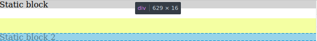

### Виняток: float.

```html
<div style="margin-bottom: 50px; background: lightgray;">Static block</div>
<div style="float: left; margin-top: 30px; background: lightblue;">Floating block</div>
```

**Результат:** вертикальний відступ — 80px (додаються).

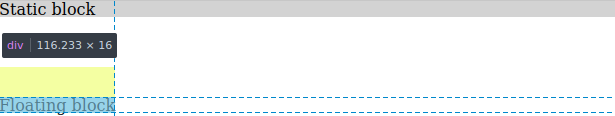

### Виняток: position: absolute.

```html
<div style="margin-bottom: 50px; background: lightgray;">Static block</div>
<div style="position: absolute; top: 100px; margin-top: 30px; background: lightblue;">Absolute block</div>
```

**Результат:** абсолютне позиціонування. Collapsing відсутній. Позиція визначається через `top`, тобто 100px.

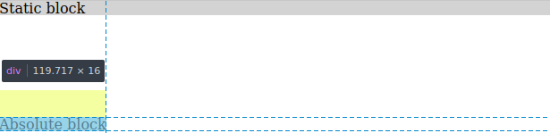

---

### Випадки, коли відбувається margin collapsing.

### 1️⃣ Сусідні елементи (Adjacent siblings).

Якщо два блоки йдуть підряд, їхні вертикальні відступи (знизу попереднього та зверху наступного) об’єднуються.

**Приклад:**

```html
<div style="margin-bottom: 50px; background: lightgray;">Block 1</div>
<div style="margin-top: 30px; background: lightblue;">Block 2</div>
```

**Результат:** 50px (більший з двох)

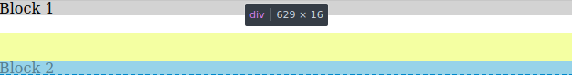

**Виняток: clear**

```html
<div style="margin-bottom: 50px; background: lightgray;">Block 1</div>
<div style="clear: both; margin-top: 30px; background: lightblue;">Block 2</div>
```

**Результат:** 80px (50px + 30px)

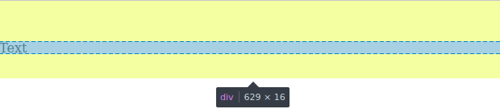

---

### 2️⃣ Між батьківським і дочірнім елементом (Parent and descendants).

Якщо немає border, padding, рядкового контенту або інших властивостей, що створюють розділення, то:

- **margin-top батьківського і margin-top дочірнього** злипаються.
- **margin-bottom батьківського і margin-bottom дочірнього** злипаються.

Об'єднаний margin буде розташований **зовні батьківського елемента**.

**Приклад:**

```html
<div style="margin-top: 50px; background: lightgray;">
  <div style="margin-top: 30px; background: lightblue;">Child</div>
</div>
```

**Результат:** 50px (зовні контейнера)

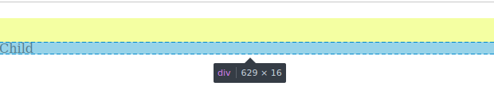

**З padding чи border**

```html
<div style="margin-top: 50px; padding: 1px; background: lightgray;">
  <div style="margin-top: 30px; background: lightblue;">Child</div>
</div>
```

**Результат:** 50px + 1px + 30px (не злипаються)

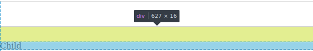

---

### 3️⃣ Порожні блоки (Empty blocks).

Якщо блок **не має** border, padding, контенту, height або min-height:
- **margin-top** і **margin-bottom** злипаються.

**Приклад без контенту:**

```html
<div style="background: lightgray;">
  <div style="margin-top: 50px; margin-bottom: 30px;"></div>
</div>
```

**Результат:** 50px (більший з двох).

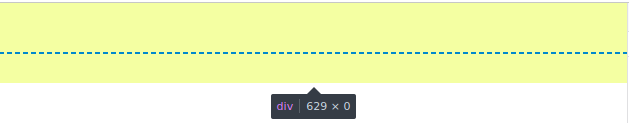

**Приклад з контентом:**

```html
<div style="background: lightgray;">
  <div style="margin-top: 50px; margin-bottom: 30px;">Text</div>
</div>
```

**Результат:** 50px + висота Text + 30px (не злипаються).

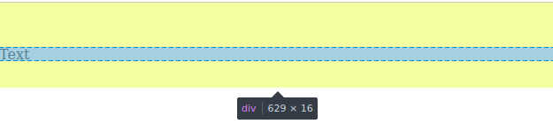


### Додаткові особливості:

- Злипання відбувається навіть із нульовими margin.

- Якщо присутні від’ємні margin:

  - Підсумковий margin дорівнює сумі найбільшого додатного та найменшого від’ємного.
  - Якщо всі margin від’ємні — вибирається найбільше за модулем (найменше від’ємне) значення.

>  - **У контейнерах з `display: flex` або `display: grid` margin collapsing не відбувається.**

## 📌 Чи бувають "злипання" з іншими CSS властивостями?

Насправді **margin collapsing** — унікальне для CSS. Але є інші схожі ситуації, які можуть збивати з пантелику:

  1. **Overflow collapsing** — коли блок з overflow: hidden або overflow: auto припиняє злипання margin всередині себе.

  2. **Padding** не злипається — він завжди додається.

  3. **Border** теж не злипається — додається.

  4. **Inline-block** елементи можуть мати небажані проміжки (через пробіли у HTML, не margin, але схоже за ефектом).

  5. **Stacking context** (накладання шарів) може впливати на рендеринг, але це вже про **z-index** і **opacity**.


## 📌 Чому у Flex і Grid немає Margin Collapsing?

У flex-контейнерах (`display: flex`) і grid-контейнерах (`display: grid`) створюється **Block Formatting Context (BFC)** автоматично, який ізолює контент і відступи. Саме тому margin collapsing всередині таких контейнерів **не відбувається**.

**BFC** — це спеціальний контекст для блокових елементів, що дозволяє:

- контролювати відступи
- уникати злипання margin
- контролювати float-елементи
- впливати на рендеринг

### Джерела:

- [MDN — Mastering margin collapsing](https://developer.mozilla.org/en-US/docs/Web/CSS/CSS_box_model/Mastering_margin_collapsing)
- [CSS-Tricks — The Rules of Margin Collapse](https://css-tricks.com/the-rules-of-margin-collapse/)
- [Block Formatting Context (MDN)](https://developer.mozilla.org/en-US/docs/Web/CSS/CSS_display/Block_formatting_context)
- [Block Formatting Context (CSS Tricks)](https://css-tricks.com/all-about-floats/#the-float-property)
